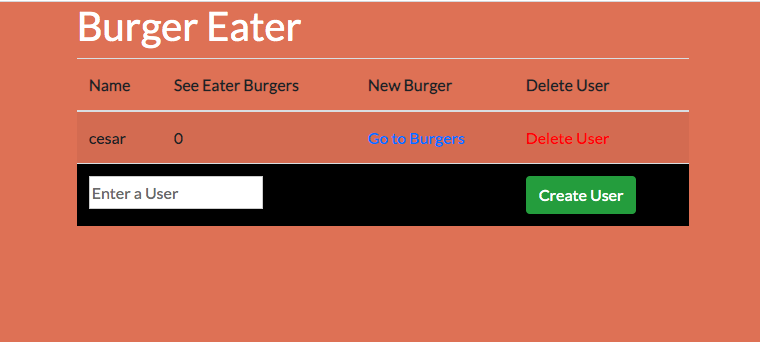

# Burger Sequalize App

In this assignment, I  Sequelized the `Burger` I made using the in my last assigment using my custom ORM.

## Technologies Used

1. HTML5
2. CSS
3. HandleBars.js
4. JavaScript
5. Node.js
6. MySql

### IMAGE OF CURRENT BURGER EATERS


### Image of Current Burgers the user has on the list to be devoured


The below code snippet is an example of how I used the ORM sequalize package to update the status of a users burger. 

```javascript
router.put("/:id", function (req, res) {
  console.log(req.body)

  db.Burger.update({
    devoured: req.body.burgerState
    }, {
      where: { id: req.body.id }
    }

  ).then(function (updatedBurger) {
    res.json(updatedBurger)
  })
})
```

### Gif of working app

